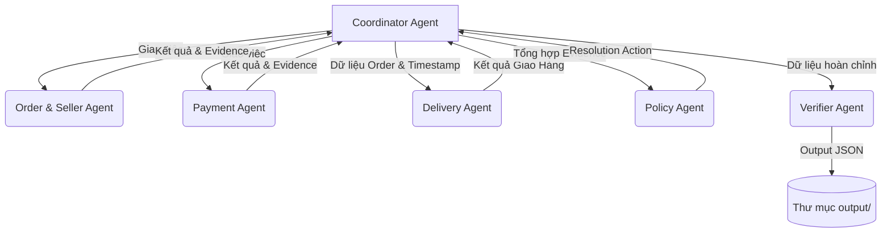

# Architecture & Infrastructure

## Sơ đồ Multi-Agent
Hệ thống được thiết kế theo luồng xử lý Multi-Agent, mỗi agent đảm nhận một miền dữ liệu cụ thể và thực hiện handoff kết quả:

## Vai trò các Agent
1. **Coordinator Agent**: Điểm vào của hệ thống, điều phối thông tin từ file input (customer request) đến các agent con, gộp dữ liệu từ các agent và xây dựng bằng chứng cuối cùng.
2. **Order & Seller Agent**: Phân tích dữ liệu từ `orders_dataset.csv`, `order_items_dataset.csv` và `sellers_dataset.csv`. Trích xuất trạng thái đơn hàng, seller, item ids và tính tổng tiền sản phẩm / cước phí vận chuyển. Kiểm tra xem seller có bàn giao hàng muộn hay không.
3. **Payment Agent**: Phân tích từ `order_payments_dataset.csv`. Tổng hợp số tiền thanh toán, kiểm tra giao dịch có khớp với giá trị đơn hàng hay không (split payment logic).
4. **Delivery Agent**: Dựa vào `order_delivered_customer_date` và `order_estimated_delivery_date` để kiểm tra kiện hàng có bị giao trễ hay không.
5. **Policy Agent**: Áp dụng các quy tắc ưu tiên (`EC_POLICY_V1`) trên các sự kiện thu thập được. Ra quyết định khoản tiền được hoàn, bên phải chịu trách nhiệm và hành động xử lý (`issue_full_refund`, `refund_freight`, v.v.).
6. **Verifier Agent**: Xác thực bằng chứng thu thập (tối đa 10 evidence IDs, 5 item IDs, 5 seller IDs) và đảm bảo output JSON đúng cấu trúc yêu cầu của bài toán trước khi ghi.

## Luồng Handoff (Handoff Flow)
- *Bước 1*: Coordinator Agent khởi tạo Case, gọi **Order & Seller Agent** và **Payment Agent**.
- *Bước 2*: Các Agent này trích xuất thông tin, trả kết quả (số tiền, ids, status) về Coordinator.
- *Bước 3*: Coordinator truyền mốc thời gian cho **Delivery Agent** để phán đoán lỗi giao hàng.
- *Bước 4*: Thông tin sau đó được đưa vào **Policy Agent** để áp dụng bộ luật xử lý.
- *Bước 5*: Dữ liệu cuối cùng được **Verifier Agent** kiểm tra tính hợp lệ về logic JSON và Evidence.
- *Bước 6*: Kết thúc chu trình và lưu tệp JSON xuống hệ thống lưu trữ.
